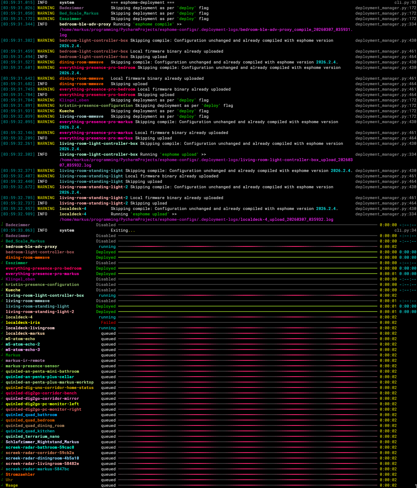

<h1 align="center">esphome-deployment</h1>
<h4 align="center">A CLI Tool for managing compilation and deployment of ESPHome Device configurations.</h4>

<div align="center">

[]()
[](https://github.com/markusressel/esphome-deployment/releases)
[](/LICENSE)

<a href="./screenshots/cli_example.png" target="_blank"></a>

<a href="https://asciinema.org/a/816877" target="_blank"></a>

</div>

## Features

* 🚀 **Batch Deployment:** Deploy to multiple devices with a single command.
* 📦 **Smart Caching:** Avoids redundant compiles by tracking configuration hashes.
* 🕵️ **Change Detection:** Only uploads binaries if the resulting build actually changed.
* 🔄 **VCS State Tracking:** Store deployment metadata in Git to sync state across CI/CD or multiple machines.
* 📋 **Detailed Logging:** Automatic per-device log capture for easy debugging.

## Setup

### Prerequisites

1. [**ESPHome CLI**](https://esphome.io/guides/installing_esphome.html) must be installed in your `PATH`.
2. A Git repository for your ESPHome device configurations.

### Reproducible Builds

For the caching mechanism of esphome-deployment to work across machines,
the firmware images produced by ESPHome need to be made _reproducible_. This means that
given the same input, the build process should always produce the exact same output binary,
bit for bit. Unfortunately, ESPHome does not currently guarantee reproducible builds out of the box, but
there are a couple of options we can add to our configuration YAML to remedy this:

#### `esphome:` Section

> `packages/esphome.yaml`
```yaml
esphome:
  platformio_options:
    build_flags:
      # 1. Prevent warnings for redefining built-in macros
      - -Wno-builtin-macro-redefined
      # 2. Force a static date and time
      - '-D__DATE__="\"Dec 29 2025\""'
      - '-D__TIME__="\"23:00:00\""'
```

See: https://esphome.io/components/esphome/

#### `esp32:` Section

> `packages/chip/esp32-esp-idf.yaml`
```yaml
esp32:
  framework:
    type: esp-idf
    sdkconfig_options:
      # options to ensure reproducible builds (exact binary match)
      CONFIG_APP_REPRODUCIBLE_BUILD: y
      CONFIG_APP_COMPILE_TIME_DATE: n
      CONFIG_APP_EXCLUDE_PROJECT_VER_VAR: y
      CONFIG_APP_EXCLUDE_PROJECT_NAME_VAR: y
```

See: https://esphome.io/components/esp32/

> [!NOTE]
> The `esp8266` does **not** support or require any special options for reproducible builds at this time.
> Only the general `esphome` section as shown above is needed.

### Installation

1. Clone this repository as a git submodule next to your ESPHome configurations
    * e.g. `git submodule add https://github.com/markusressel/esphome-deployment`
2. Ensure your configurations utilize the reproducible build options as shown above
    * e.g. via packages for both ESPHome and ESP32 devices containing the options above
3. Use `poetry` (or any other method of your choice) to run esphome-deployment (see below)

```bash
python3 -m venv venv
. venv/bin/activate && pip install --upgrade pip poetry
poetry install -P ./esphome-deployment
```

## Usage

```
Usage: esphome-deployment [OPTIONS] COMMAND [ARGS]...

Options:
  --version   Show the version and exit.
  -h, --help  Show this message and exit.

Commands:
  clean    Clean
  compile  Compile the given deployment(s)
  config   Print the current configuration
  deploy   Deploy (compile + upload) the given deployment(s)
  upload   Upload the given deployment(s)
```

## Configuration

### Main configuration

The main configuration for esphome-deployment can be specified in a file named `.esphome_deployment.yaml` located next to your ESPHome configurations (within your working
directory).
See [`.esphome_deployment.yaml`](.esphome_deployment.yaml) for all available options.

### Per-Device configuration

Each ESPHome configuration can optionally contain a `.esphome_deployment:` section (note the leading dot) to adjust the deployment behavior for that specific device.
Example:

```yaml
.esphome_deployment:
  deploy: true
  tags:
    - bluetooth_proxy

packages:
  esphome: !include packages/esphome.yaml
  chip: !include packages/chip/esp32-esp-idf.yaml

... rest of your esp home config ...
```

## Repository layout, state files and logs

Recommended layout for a repository using `esphome-deployment` to deploy multiple ESPHome configurations:

```
<repo-root>/
├── packages/                 # reusable package files (recommended)
│   ├── esphome.yaml
│   └── chip/...
├── .deployment-state/        # (generated) per-deployment JSON state files, commit this to VCS to share state across machines
├── .deployment-logs/         # (generated) CLI logs for compile/upload runs
├── .esphome_deployment.yaml  # global config for esphome-deployment
├── secrets.yaml
├── your-device-1.yaml        # individual deployment yamls (put in repo root)
└── your-device-2.yaml
```

> [!TIP]
> **Commit your state!** By committing the `.deployment-state/*.json` files, esphome-deployment will know exactly which devices are already up-to-date even when
> running it on a different machine.

Add this to your `.gitignore`:

```gitignore
# Ignore generated log files from esphome-deployment, but keep the deployment state files for VCS tracking
.deployment-logs/
```

### Deployment State

esphome-deployment remembers the compilation and upload state for each deployment configuration in a JSON file within `.deployment-state/`.
- What they are: For every esphome invocation the CLI writes a log into `.deployment-logs/` in the same directory as your device YAMLs. Filenames are like
  `<deployment>_<command>_YYYYMMDD_HHMMSS.log` and contain merged stdout/stderr from the esphome CLI. These logs are invaluable for debugging compile/upload issues.

### Logs

esphome-deployment captures the output of each esphome CLI invocation and saves it to a log file in `.deployment-logs/` for later inspection. This includes both stdout and stderr,
merged together with timestamps for easier debugging.

```bash
# list recent logs
ls -lt .deployment-logs/

# view a specific log
less .deployment-logs/<filename>.log

# follow a log in real time
tail -f .deployment-logs/<filename>.log
```

> [!WARNING]
> **Privacy note:** Logs may contain IPs, device identifiers or other runtime information. Treat them as potentially sensitive when sharing.
